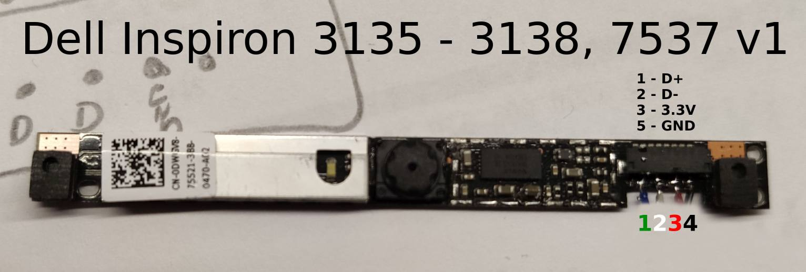
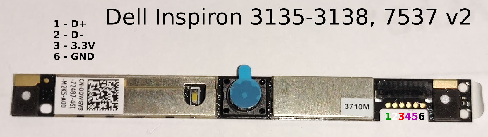
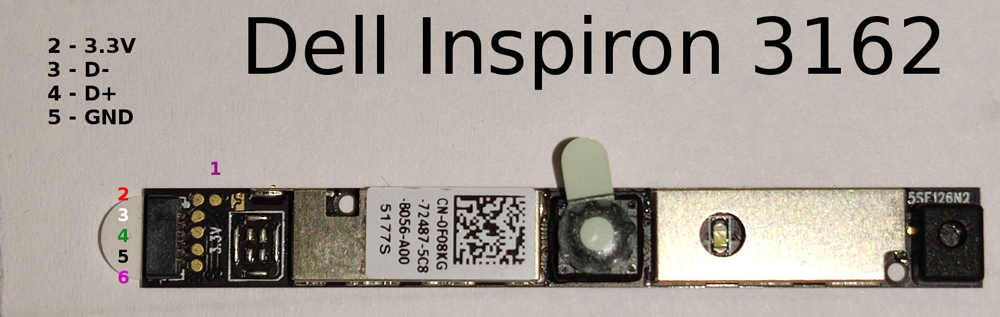
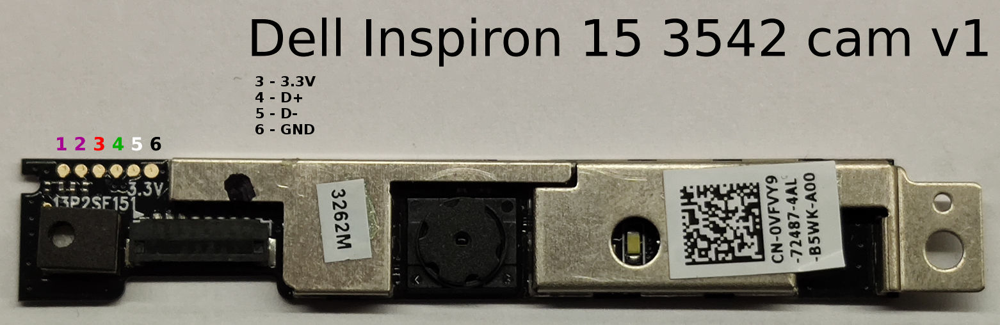
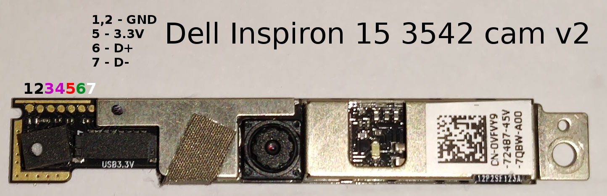
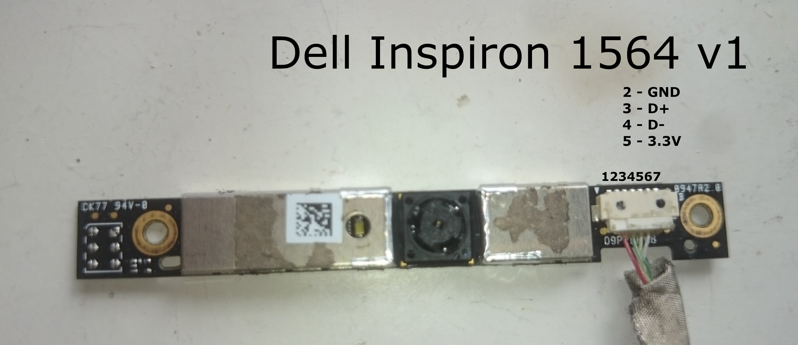

## Overview
Goal of this project is to make use of cheap, easily available laptop cameras and repurpose them as fully functional USB cameras.

You can find the list of tested cameras & pinouts below. The same model of camera can have different PCB version, thus different test point alignment, so watch out.

If your cam is not on the list, please read the [tutorial here](#how-to-reverse-engineer-camera-pinout).

## To Do
- [ ] design 3d cases for tested cameras
- [ ] add more cams

## List of cameras tested

Laptop model|P/N|PCB versions
--|--|--
Dell Inspiron 3135 / 7537|0DWGV8|2
Dell Inspiron 3162|0F08KG|1
Dell Inspiron 3542|0VFV69|2
Dell Inspiron 1564|0947A2|1

## Pinouts
### Dell Inspiron 3135 / 7537

### Dell Inspiron 3162

### Dell Inspiron 3542

### Dell Inspiron 1564

## How to reverse engineer camera pinout.

### You are doing it at your own risk so don’t damage your favorite PC - I'm not responsible for that.

Laptop camera pinouts can differ. Number of pins and test pads is determined by presence of mics and additional hardware. Usually, there are 4 USB pins (GND, 3.3V, D+, D-) and 2 additional pins for the mic.

Microphones are usually directly connected to soundcard built into laptop's motherboard, despite the fact that many camera chips (like SONIX SN9C280AJG in Inspiron 3135 cam) have built in ADC and audio codec for mic connection.

Ideally, choose a laptop camera with exposed test pads, to which you can solder to - otherwise, you will probably also need the camera lead with a plug or a very steady hand.

To find the necessary pins, you will need a multimeter with diode test function and, ideally, a lab bench power supply, not to fry your camera. But, if you are 100% sure, 2x 1n4001 diodes and a USB cable will be enough.

####  1. Finding GND
GND is the easiest pin to find: select continuity test on your multimeter, using the first test lead touch a large GND field on your camera's PCB or part of metal shielding, and, using the other test lead, find the appropriate test pad or pin.

####  2. Finding D+ / D-
Diodes used in USB data lines of camera chips are usually paired thus have almost identical forward-biased diode voltage drop. You have to find pins with identical voltage drop.
Take negative test lead and connect it to GND, using positive test lead find two pins/test pads that have identical voltage drop - these lines will be your data lines D+ and D-.

You will have to find out which one of the two is D+ and which one is D- by connecting it to a PC, after you find the last 3.3V pin.

If data pins are reversed, the computer will detect some USB device, but won't be able to get USB device ID, if the order is correct, obviously, the device will be recognized.

#### 3. Finding 3.3V
This is the hardest one. The easiest way is to find large SMD capacitor near camera chip with one lead connected to GND, it is called a decoupling capacitor. The other lead of that capacitor will be connected to 3.3V line. Touch the 3.3V capacitor lead with one test lead and using continuity check function, find 3.3V pin/test pad.

#### 4. Connecting everything together
Firstly, it's recommended to test GND and 3.3V pins by connecting them to lab bench power supply and setting overcurrent protection to 100mA.
Cameras which I've tested, initially consumed 10-15mA for 1-2s and then shutdown when they couldn’t establish USB connection on data lines.

When you are sure about which pin is which, you can connect your camera's:
* data lines and GND directly
* power supply : we need to use two 1n4001 or other **silicone** diode in series to achieve 1.3 - 1.7V voltage drop in order to protect the camera - it needs only 3.3V to work.

If everything is correct, your OS should recognize your cam and you should be able to get the image from it.
